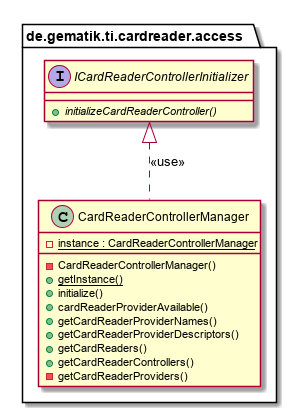

# CardReaderAccess

## Introduction

This part describes the usage of CardReaderAccess API in order to use different card reader and provider in your application.
The CardReaderAccess API provides a registry for higher layer applications to inform about new connected and disconnected card reader.

The CardReaderAccess API provides functionalities for all card reader [???](#Service Provider) discovers by ServiceLoader.
CardReaderAccess API implements the ServiceLoader for card reader [???](#Service Provider). This has the role of discovering and loading implementations lazily.

## API Documentation

Generated API docs are available at <https://gematik.github.io/ref-CardReaderAccess>.

## License

Licensed under the [Apache License, Version 2.0](https://www.apache.org/licenses/LICENSE-2.0).

## Overview

  

### CardReader Events

If an application or library user would receive information’s about card reader connection or disconnection must the receiver subscribe to EventBus for Event
`CardReaderConnectedEvent` and `CardReaderDisconnectedEvent`.

For usage see [???](#CardReaderConnectionEvents)

### CardReaderControllerManager

This manager object provides functionalities over all [CardReaderController](#ICardReaderController) and [CardReaderProviders](#provider) to request all available card readers and information’s about [CardReaderProviders](#provider) (e.g. licence, description).
Furthermore is this manager the service loader for [CardReaderProviders](#provider) in your application.

  

The special and optional functionality is the initializer method for [CardReaderController](#ICardReaderController).
The initialize method will call with implementation object of [???](#ICardReaderControllerInitializer).
The [ICardReaderControllerInitializer](#_cardreadercontrollerinitializer) will call from CardReaderControllerManager for each found [???](#ICardReaderController)
and the implementation of [???](#ICardReaderControllerInitializer) will decides for which [???](#ICardReaderController) is something todo.
This methodology makes it possible to inject the e.g. android application context to [service provider](#provider) from higher layer applications without pass-through each layer.
The following sequence diagram describe the workflow for initialization on ctc1 (represents an android specific ICardReaderController implementation) and ctc2 (plain java implementation e.g. pcsc ICardReaderController implementation).
The [???](#ICardReaderControllerInitializer) decides the need of android context.

  

### CardReaderControllerInitializer

The implementing class for ´ICardReaderControllerInitializer´ interface will initialize [CardReaderController](#ICardReaderController) e.g. inject android application context or prepare environment.

  

## Getting Started

### Build setup

To use CardReaderAccess API library in a project, you need just to include following dependency:

**Gradle dependency settings to use CardReaderAccess API library.**

    dependencies {
        implementation group: 'de.gematik.ti', name: 'cardreader.access', version: '1.1.2'
    }

**Maven dependency settings to use CardReaderAccess API library.**

    <dependencies>
        <dependency>
            <groupId>de.gematik.ti</groupId>
            <artifactId>cardreader.access</artifactId>
            <version>1.1.2</version>
        </dependency>
    </dependencies>
